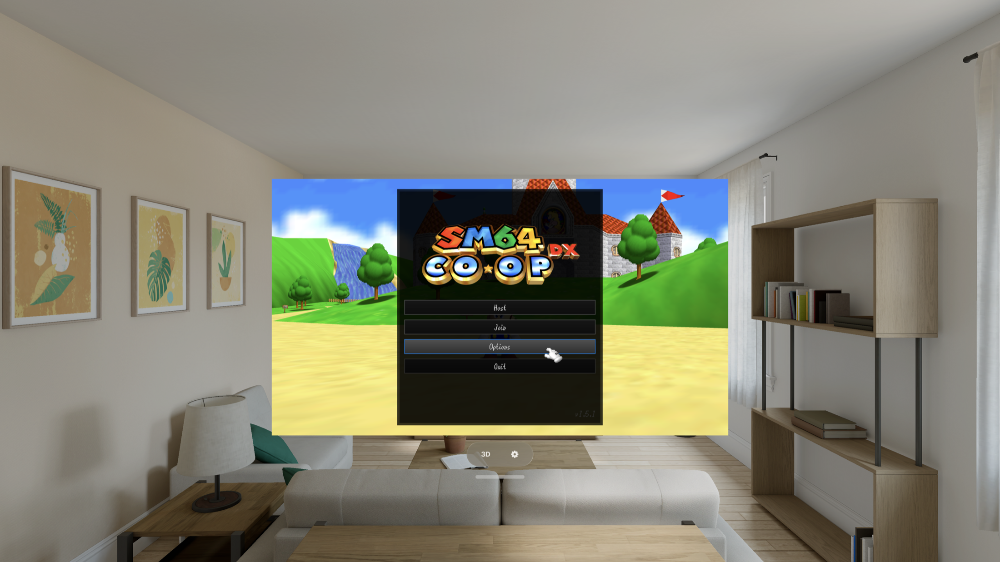

# Super Mario 64 Co-op Deluxe for Apple Vision Pro

Play **Super Mario 64 Co-op Deluxe** on your Apple Vision Pro — the full game,
online co-op, and a stereoscopic **3D mode** that puts Mario on a world-locked
screen floating in your room with real depth. 100% vibe coded with lots of passion
and attention to detail.

Built on [sm64coopdx](https://github.com/coop-deluxe/sm64coopdx) (the Coop Deluxe
Team's online-multiplayer Super Mario 64 port), rendering natively on **Metal**.
Forked from [sm64coopdx-ios](https://github.com/LeoManrique/sm64coopdx-ios/).



---

## Install

**Add the SideStore source** — the easiest path, and the app auto-updates when new versions ship:

| Device | Source URL |
| --- | --- |
| Apple Vision Pro | `https://raw.githubusercontent.com/rebelancap/sm64coopdx-ios/main/sidestore/apps-visionos.json` |

On **Apple Vision Pro**, first install SideStore onto the headset with
[iloader](https://github.com/rebelancap/iloader/releases#release-visionos) (this custom version supports visionOS). Then, in SideStore:
*Sources → **+** → paste the URL*, and install sm64coopdx. No Xcode or Dev Strap required.

**Prefer a manual install?** Download `sm64coopdx-*-visionOS.ipa` from the
[latest release](../../releases/latest) and install it through SideStore yourself.

Then **add your ROM** (see below) at first launch, or via the **Files** app →
*On My Apple Vision Pro → sm64coopdx* → drop the file in.

## You bring the ROM

sm64coopdx ships with **no game content** — nothing copyrighted is included. To play,
you supply your own **Super Mario 64 (US) ROM**: a `.z64` file, 8 MB, from a copy you
legally own. On first launch the app shows a ROM-setup screen and waits until it sees a
valid US ROM; drop the `.z64` into the app's folder (Files → *On My Apple Vision Pro →
sm64coopdx*) and it loads everything it needs directly from the ROM. Nothing is extracted
to distribute, and the ROM never leaves your device.

Your settings and save files live alongside the app's data and are never touched when you
swap ROMs.

## Features

- The **full Super Mario 64 campaign**, rendered natively on Metal
- **Online co-op** — join or host over [CoopNet](https://github.com/coop-deluxe/coopnet);
  the whole reason coopdx exists, running on Vision Pro
- **Game controllers** — plays great with any paired gamepad; on-screen touch controls
  appear automatically when no controller is connected (gaze-and-pinch the menus)
- Character models, palettes, and the coopdx menus and settings, all in-app and persistent
- **60 / 90 / 120 Hz** — auto-detects your headset's panel (M5 Vision Pro runs up to 120)
- **The 3D mode** — the game on a world-locked stereoscopic panel floating in your room
  (mixed immersion), with **spatial audio anchored at the screen** and everything
  live-tunable while you play:
  - **Stereo depth** — how much the world pops out of the panel
  - **Focus distance** — the zero-parallax plane, with an **Auto** mode that adapts to
    your screen size (or set it by hand, in feet or metres)
  - **Screen size, distance, and height** — reshape the panel to any aspect (ultra-wide
    or tall) and it re-renders at true widescreen FOV rather than stretching Mario
  - **Surroundings dimming** and a **recenter** button
  - The 2D window parks as a small control card while you're in 3D, and restores when you exit

## Requirements

- **Apple Vision Pro** (visionOS 2+)
- A sideloading tool — [SideStore](https://sidestore.io), installed on the headset via
  [iloader](https://github.com/rebelancap/iloader/releases#release-visionos)
- Your own Super Mario 64 (US) ROM

## FAQ

**Is any game content included?** No. You supply your own ROM; nothing copyrighted ships
with the app, and nothing is extracted off your device.

**Which ROM do I need?** The **US** release of Super Mario 64 — an 8 MB `.z64` file. Other
regions aren't supported.

**Online co-op works on Vision Pro?** Yes — CoopNet, the same online multiplayer as desktop
coopdx. Join a public server or host your own.

**What about iPhone / iPad?** This project is focused on Apple Vision Pro. For iPhone/iPad
sm64coopdx, see [LeoManrique/sm64coopdx-ios](https://github.com/LeoManrique/sm64coopdx-ios),
whose iOS work this port builds on.

**The app stopped launching after about a week?** Apps sideloaded with a free Apple account
expire after 7 days (paid developer accounts last a year). SideStore refreshes them
automatically in the background — open SideStore and let it re-sign.

---

## Building from source

Requires macOS with Xcode and `cmake` (`brew install cmake`).

```sh
scripts/bootstrap.sh          # vendor sm64coopdx @ pin + apply the overlay (once)
scripts/fetch-sdl2.sh         # SDL2 source (once)
scripts/build-deps-xros.sh    # CoopNet + other xrOS dependency slices (once)
scripts/build-visionos.sh     # the merged 2D + 3D visionOS app (signed)
```

Upstream sm64coopdx is vendored unmodified and pinned by commit; every local change is a
reviewable patch in `overlay/patches/`, applied by `scripts/apply-overlay.sh`. The gfx_pc
Metal backend and the visionOS shell live under `app/`.

## Credits

- [sm64coopdx](https://github.com/coop-deluxe/sm64coopdx) by the **Coop Deluxe Team**,
  continuing [sm64ex-coop](https://github.com/djoslin0/sm64ex-coop) by **djoslin0**
- iOS groundwork by [LeoManrique](https://github.com/LeoManrique/sm64coopdx-ios)
- Super Mario 64 © Nintendo. This project ships **no** Nintendo content; you supply your
  own ROM. Matching upstream sm64coopdx, no separate license is asserted over the port.
